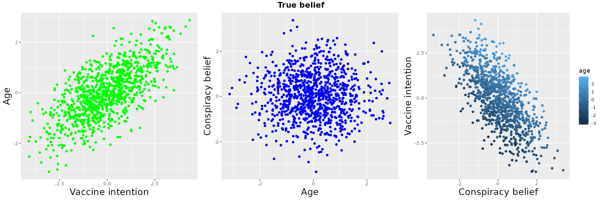
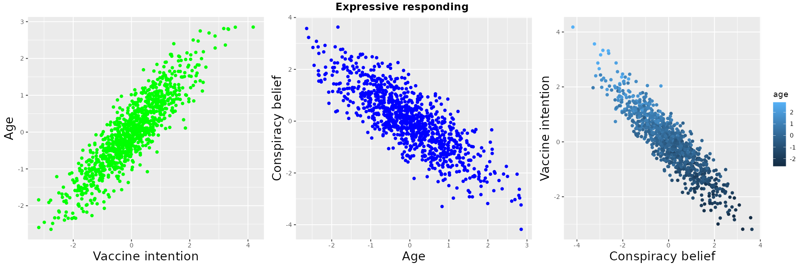

```{r include = FALSE}
#defaults
knitr::opts_chunk$set(warning = FALSE)
knitr::opts_chunk$set(message = FALSE)

```

*Showing my working on a problem of simple causal inference. I am aware that I lack the background on this to, so pointers welcome*

# Conspiracy theories and vaccine intentions

With Indro Adinugroho, I've been thinking about conpiracy theories, and particularly conspiracy theories around the covid-19 vaccine. Obviously it matters if people belief in falsehoods, and it matters even more if these beliefs cause them to put themselves and others at risk by avoiding vaccination. 

There is a clear negative correlation between intention to get vaccinated and endorsement of conspiracy theories about the vaccine. As with all correlations there is a problem of causal inference. Maybe the beliefs drive the intentions (let's call this the "true belief" model), which is what a rational actor model would predict. 

But it is perfectly possible that the intentions drive the beliefs - this is so called "expressive responding". Under expressive responding, people arrive at a position and the attitudes they express to you, the researcher, are meant to signal that position rather than being genuinely endorsed. 

# Indentification

Economists talk about "causal identification", or just "identification", and how it can be done from observational data. Obviously experiments are best for causal inference, and if you can't do an experiment there might be natural experiments or things which afford [RDD](https://en.wikipedia.org/wiki/Regression_discontinuity_design) analyses.

There are - I'm told - a host of other identification strategies which allow weaker support for causal inferences

> Question: is there a good review or tutorial of different classes of identification strategies?

One strategy might be to identify a third variable which is randomly distributed and causally linked to only one of the variables of interest in your correlation. It is this possibility that this note is concerned about. 


# Three variables, two models

I was asking about casual identification at the NYE party (yes, that's how I roll), and K. suggested that age might be a good quasi-random variable to help with identification in this domain. Covid is famously more dangerous the older you are, so age should predict intention to get vaccinated, but maybe it is unrelated to conspiracy beliefs about the vaccine (you could argue it either way - there is some evidence that older people are more vulnerable to fake news, but also younger people are maybe more online, so might get more exposure to conspiracies). For the sake of argument, let's assume that age effects intention to get vaccinated, but not conspiracy beliefs.

This gives us three variables

 * **A**ge
 * **V**accine intention
 * **C**onspiracy belief
 
And so two models.

**True Belief**, where age affects vaccine intentions, but conspiracy belief also affects vaccine intentions


**Expressive responding**, where age affects vaccines intentions, and then in turn vaccine intentions drive conspiracy beliefs


I know that the expressive belief model is an extreme. Surely vaccine conspiracy beliefs and intentions mutually affect each other, but let's consider for a while the world where conspiracy beliefs are determined by intentions - i.e. are entirely expressive and not causal.


# Simulating the two models

To help me think about recovering the true causal structure from observed data, I wanted to simulate plausible data. Robin Denz simDAG package helped me do this quickly and easily. Kudos Robin! <https://github.com/RobinDenz1/simDAG>

The code looks like this

```{e eval=FALSE}

#define model
modelname = 'True belief'
dag <- empty_dag() +
  node("age", type="rnorm", mean=0, sd=1) +
  node("int", type="gaussian", parents=c("age","con"), betas=c(1,-1),
       intercept=0, error=0.5) +
  node("con", type="rnorm", mean=0,sd =1)
  
#simulate data  
sim_dat <- sim_from_dag(dag, n_sim=1000)
```

Here are plots, from left to right

 * Vaccine Intention and Age scatterplot - strong correlation (as defined)
 * Age and Conspiracy Belief scatterplot - no correlation
 * Conspiracy Belief and Vaccine Intention scatterplot - strong correlation (as defined), and NOTE higher correlation between Conspiracy and Vaccine intention is also there for high and low age individuals (with a parallel shift due to age, you can see the high age points are distributed over the full range of both variables, but shifted right)


  
Here's the expressive responding code and simulated data


```{e eval=FALSE}

#define model
modelname = 'Expressive responding'
dag <- empty_dag() +
  node("age", type="rnorm", mean=0, sd=1) +
  node("int", type="gaussian", parents=c("age"), betas=c(1),
       intercept=0, error=0.5) +
  node("con", type="gaussian", parents=c("int"), betas=c(-1),
       intercept=0, error=0.5)
```

Here are plots, from left to right
* Vaccine Intention and Age scatterplot - strong correlation (as defined)
* Age and Conspiracy Belief scatterplot - strong correlation (because Age -> Vaccine Intention and Vaccine Intention -> Conspiracy Belief)
* Conspiracy Belief and Vaccine Intention scatterplot - strong correlation (as defined), but NOTE that the high age indivudals are now clustered in the top left of the distribution (high intention, low conspiracy belief)


  
# The question

So here's the question:

Given real data collected on Age, Vaccine Intention and Conspiracy Belief, how can I tell which causal model holds?

In the real data (not shown) there is weak, but statistically significant, correlation between age and conspiracy belief. To the extent that I only consider the two causal m odels introduced here, can I take that as evidence of some non-zero component of expressive responding (i.e that the causal influence of age leaks through to conspiracy belief).

To some extent, just to be able to show evidence of non-zero expressive responding (that Vaccine Intention -> Conspiracy Beliefs) is a win. What's the best way to do this?

Ideally, thought, I would like to be able to weigh the evidence for both models and come up with some relative strength for each, ie to be able to parameterise the extent to which the causal paths exist, or don't.


# Colophon

Repo: <https://github.com/tomstafford/truebelief>
