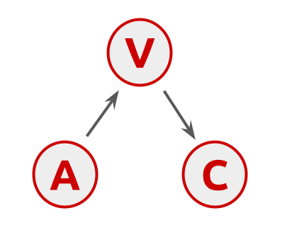

```{r include = FALSE}
#defaults
knitr::opts_chunk$set(warning = FALSE)
knitr::opts_chunk$set(message = FALSE)

```

*Showing my working on a problem of simple causal inference. I am aware that I lack the background on this to, so pointers welcome*

# Conspiracy theories and vaccine intentions

With Indro Adinugroho, I've been thinking about conpiracy theories, and particularly conspiracy theories around the covid-19 vaccine. Obviously it matters if people belief in falsehoods, and it matters even more if these beliefs cause them to put themselves and others at risk by avoiding vaccination. 

There is a clear negative correlation between intention to get vaccinated and endorsement of conspiracy theories about the vaccine. As with all correlations there is a problem of causal inference. Maybe the beliefs drive the intentions (let's call this the "true belief" model), which is what a rational actor model would predict. 

But it is perfectly possible that the intentions drive the beliefs - this is so called "expressive responding". Under expressive responding, people arrive at a position and the attitudes they express to you, the researcher, are meant to signal that position rather than being genuinely endorsed. 

# Indentification

Economists talk about "causal identification", or just "indentification", and how it can be done from observational data. Obviously experiments are best for causal inference, and if you can't do an experiment there might be natural experiments or things which afford [RDD](https://en.wikipedia.org/wiki/Regression_discontinuity_design) analyses.

There are - I'm told - a host of other indentification strategies which allow weaker support for causal inferences

> Question: is there a good review or tutorial of different classes of identification strategies?

One stategy might be to identify a third variable which is randomly distributed and causally linked to only one of the variables of interest in your correlation. It is this possibility that this note is concerned about. 


# Three variables, two models

I was asking about casual identification at the NYE party (yes, that's how I roll), and K. suggested that age might be a good quasi-random variable to help with identification in this domain. Covid is famously more dangerous the older you are, so age should predict intention to get vaccinated, but maybe it is unrelated to conspiracy beliefs about the vaccine (you could argue it either way - there is some evidence that older people are more vulnerable to fake news, but also younger people are maybe more online, so might get more exposure to conspiracies). For the sake of argument, let's assume that age effects intention to get vaccinated.

This gives us three variables
 * **A**ge
 * **V**accine intention
 * **C**conspiracy belief
 
And so two models.

True Belief, where age affects vaccine intentions, but conspiracy belief also affects vaccine intentions


Expressive respondingm, where age affects vaccines intentions, and then in turn vaccine intentions drive conspiracy beliefs




I know that the expressive belief model is an extreme. Surely vaccine conspiracy beliefs and intentions mutually affect each other, but let's consider for a while the world where conspiracy beliefs are determined by intentions - i.e. are entirely expressive and not causal.


# Simulating the two models


  * Silver, I., Mellers, B.A. and Tetlock, P.E. (2021) 'Wise teamwork: Collective confidence calibration predicts the effectiveness of group discussion', *Journal of Experimental Social Psychology*, 96, p. 104157. <https://doi.org/10.1016/j.jesp.2021.104157>

Silver, Mellers and Tetlock (2021) found that group interactions were likelier to yield increased accuracy if more accurate members were more confident in their own judgment and less accurate members less confident. By visuialising how the discussions change individuals answers we can see how different kinds of groups contribute to these effects.

# Visualising how discussion moves individuals' answers

We use an arrow to represent the pre and post discussion scores of each group. Each group has multiple discussions and each discussion is shown with a single arrow <!-- LINGU how many questions did each group do-->

The y-axis shows Error, which is a z-score (normalised at a question level) of the absolute difference value between the average answer of the individuals in the group and the correct answer. Higher scores are worse performance.

The x-axis shows Disagreement, which is z-score (normalised at a question level) of standard deviation of the answers of the individuals in the groups. Higher scores are more disagreement (variance) among the group in their answers.

. In other word, we have an arrow for each group in every question, form point1 to point2: point1 = (Deviation_Time1, Error_Time1) point2 = (Deviation_Time2, Error_Time2)

<details>
```{r set up, message = FALSE}
library("tidyverse")
library("cowplot")
```

```{r data input, warning = FALSE, message = FALSE}

#get data from https://osf.io/a4cf7/?action=download",destfile="data1.csv")

group_data <- read_csv("data1.csv")
group_data <- mutate(group_data, agree = sd2 < sd1) # create a new variable to indicate whether group agreement formed
```

```{r normalised}
group_data_n <- group_data %>% 
  pivot_longer(cols = 8:9,   names_to ="acc_time", values_to = "acc_val") %>% 
  pivot_longer(cols = 12:13, names_to ="agr_time", values_to = "agr_val") %>% 
  group_by(qcode) %>% 
  mutate(acc_val = scale(acc_val), agr_val = scale(agr_val)) %>% 
  pivot_wider(names_from = "acc_time", values_from = "acc_val") %>% 
  pivot_wider(names_from = "agr_time", values_from = "agr_val") %>% 
  mutate(agree = as.factor(agree), improve = as.factor(improve)) %>% 
  ungroup(qcode)
```
</details>

We look only at Silver, Mellers & Tetlock (2021), study 1. Showing all groups and all questions:

<details>
```{r figure 1. group data, warning = FALSE}
arrow_graph_n <- ggplot() +
  geom_segment(aes(x = sd1, y = aee1, xend = sd2, yend = aee2), data = group_data_n, arrow = arrow(length=unit(0.1,"inches")), alpha = 0.1) + 
  theme_cowplot() + xlab('Disagreement') + ylab('Error') + ylim(-3, 5) + xlim(-2, 5) + theme(aspect.ratio=1) 
```
</details>

```{r echo=FALSE, fig.cap="Figure 1: Movement of each group pre/post discussion, in normalised diagreement-error space"}
arrow_graph_n # normalised 
ggsave("figure_1.jpg")
```

## Converging vs diverging discussions

Now we show the average movement for two kinds of discussions: those where disagreement reduced (the group's answers converged) vs those where diagreenebt increased (the group's answers diverged). The arrow thickness represents the number of dicussions in each category:

<details>
```{r figure 2. averaged movement breaked down on agreement}
averaged_data_n <- group_data_n %>% 
  select(sd1, sd2, aee1, aee2, agree) %>% 
  group_by(agree) %>% 
  summarise(sd1 = mean(sd1), sd2 = mean(sd2), aee1 = mean(aee1), aee2 = mean(aee2), case = n()/100)
line_thickness <- averaged_data_n %>% select(case) %>% unlist() %>% as.vector() # don't mapping thickness by aes(size = x)

arrow_graph_agree_n_average <- ggplot() +
  geom_segment(aes(x = sd1, y = aee1, xend = sd2, yend = aee2), data = group_data_n, arrow = arrow(length=unit(0.1,"inches")), alpha = 0.2, size = 0.1) + 
  geom_segment(aes(x = sd1, y = aee1, xend = sd2, yend = aee2, colour = agree), data = averaged_data_n %>% filter(agree == 'TRUE'), arrow = arrow(length=unit(0.1,"inches")), alpha = 1, lwd = (line_thickness[2]+1)/avg_scale) + 
  geom_segment(aes(x = sd1, y = aee1, xend = sd2, yend = aee2, colour = agree), data = averaged_data_n %>% filter(agree == 'FALSE'), arrow = arrow(length=unit(0.1,"inches")), alpha = 1, lwd = (line_thickness[1]+1)/avg_scale) + 
  theme_cowplot() + xlab('Disagreement') + ylab('Error') + ylim(-3, 5) + xlim(-2, 5) + guides(size = "none") + theme(aspect.ratio=1)
```
</details>

```{r echo=FALSE, fig.cap="Figure 2: Movement of each group pre/post discussion, in normalised diagreement-error space, highlighting average movement for groups which agree more vs less following discussion"}
arrow_graph_agree_n_average # normalised broken down with whether group agreement were formed
ggsave("figure_2.jpg")
```

## Error increasing or reducing discussions

Now we show the average movement for two kinds of discussions: those where individual's answers became more accurate vs those where individual's answers became less accurate. The arrow thickness represents the number of discussions in each category:

<details>
```{r figure 3. averaged movement breaked down on improvement, warning = FALSE}
averaged_data_n <- group_data_n %>% 
  select(sd1, sd2, aee1, aee2, improve) %>% 
  group_by(improve) %>% 
  summarise(sd1 = mean(sd1), sd2 = mean(sd2), aee1 = mean(aee1), aee2 = mean(aee2), case = n()/100)

line_thickness <- averaged_data_n %>% select(case) %>% unlist() %>% as.vector() # assign thickness of arrows by case numbers

levels(averaged_data_n$improve) <- c("FALSE", "TRUE") # rename improvement level

arrow_graph_improve_n_average <- ggplot() +
  geom_segment(aes(x = sd1, y = aee1, xend = sd2, yend = aee2), data = group_data_n, arrow = arrow(length=unit(0.1,"inches")), alpha = 0.2, size = 0.1) +
  geom_segment(aes(x = sd1, y = aee1, xend = sd2, yend = aee2, colour = improve), data = averaged_data_n %>% filter(improve == 'TRUE'), arrow = arrow(length=unit(0.1,"inches")), alpha = 1, lwd = (line_thickness[2]+1)/avg_scale) + 
  geom_segment(aes(x = sd1, y = aee1, xend = sd2, yend = aee2, colour = improve), data = averaged_data_n %>% filter(improve == 'FALSE'), arrow = arrow(length=unit(0.1,"inches")), alpha = 1, lwd = (line_thickness[1]+1)/avg_scale,) + 
  theme_cowplot() + xlab('Disagreement') + ylab('Error') + ylim(-3, 5) + xlim(-2, 5) + guides(size = "none") + theme(aspect.ratio=1)
```
</details>


```{r echo=FALSE, fig.cap="Figure 3: Movement of each group pre/post discussion, in normalised diagreement-error space, highlighting average movement for groups which improve or degrade in accruacy following discussion"}
arrow_graph_improve_n_average # normalised broken down with whether group agreement were formed
ggsave("Figure_3.jpg")
```

We can see that group usually moved towards each other (670 agree vs 57 disagree), but also regardless of convergence/divergence their average performance improved. 

Split by error, many groups didn't improved their performance (451 improve vs 276 degrade).

Looking at Figure 2, the arrow of positive agreement group is much longer than negative agreement group, which supports the idea that group dynamics support consensus over polarisation (along with there being more groups which agreed than disagreed).

Looking at Figure 3, the longer arrow for improving discussions perhaps suggests that agreement supports error reduction.

## Additional plots

We colour the arrows by the two kind of class to show how they changed their answer.

<details>
```{r figure 4. group date breaked down separately, warning = FALSE}
levels(group_data_n$improve) <- c("FALSE", "TRUE") # rename improvement level

arrow_graph_agree_n <- ggplot() +
  geom_segment(aes(x = sd1, y = aee1, xend = sd2, yend = aee2, colour = agree), data = group_data_n, arrow = arrow(length=unit(0.1,"inches")), alpha = 0.3) + 
  theme_cowplot() + xlab('Disagreement') + ylab('Error') + ylim(-3, 5) + xlim(-2, 5) + theme(aspect.ratio=1)
```
</details>

```{r echo=FALSE, fig.cap="Figure 4: Movement of each group pre/post discussion, in normalised diagreement-error space, highlighting groups which agree more vs less following discussion"}
arrow_graph_agree_n # normalised broken down with whether group agreement were formed
ggsave("Figure_4.jpg")
```

<details>
```{r figure 5. group date breaked down separately, warning = FALSE}
arrow_graph_accuracy_n <- ggplot() +
  geom_segment(aes(x = sd1, y = aee1, xend = sd2, yend = aee2, colour = improve), data = group_data_n, arrow = arrow(length=unit(0.1,"inches")), alpha = 0.3) + 
  theme_cowplot() + xlab('Disagreement') + ylab('Error') + ylim(-3, 5) + xlim(-2, 5) + theme(aspect.ratio=1)
```
</details>

```{r echo=FALSE, fig.cap="Figure 5: Movement of each group pre/post discussion, in normalised diagreement-error space, highlighting groups which improve or degrade in accruacy following discussion"}
arrow_graph_accuracy_n # normalised broken down with whether group performance were improved
ggsave("Figure_5.jpg")
```

# Colophon

Repo: <https://github.com/Lingyu-Meng/convergence-valence_space>

*Thanks to Nick Byrd for discussion*

